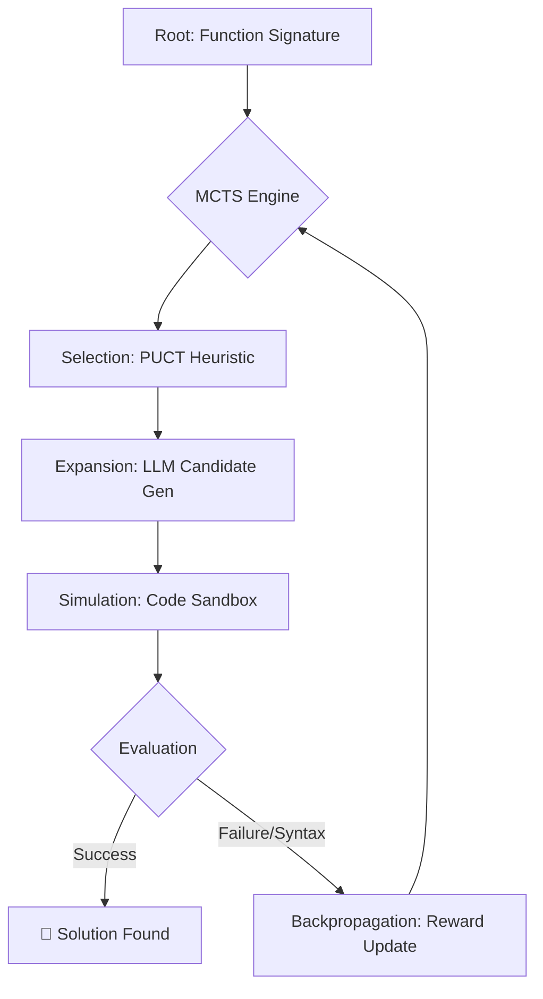

# CogniCode-MCTS: Inference-Time Reasoning via Tree Search

**A Research Framework for System-2 Thinking in Code Generation.**


## Abstract
Current Large Language Models (LLMs) operate primarily as **"System 1"** thinkers—generating tokens based on immediate probability distributions without lookahead. This autoregressive nature often results in syntax errors, logic bugs, and hallucinations, particularly in complex code generation tasks where early errors propagate.

**CogniCode-MCTS** implements a **"System 2"** reasoning layer using **Monte Carlo Tree Search (MCTS)** and the **PUCT** selection heuristic. By treating code generation as a state-space search problem, this framework allows the model to explore multiple implementation paths, verify logic in a sandbox, and backtrack from dead ends.

---

## Technical Architecture

The system follows a Reinforcement Learning from Symbolic Feedback (RLSF) pattern, providing a deterministic "Ground Truth" to a non-deterministic generative model.



### Key Methodology
*   **PUCT Selection:** Balances prior probability $P(s,a)$ from the LLM with exploration-driven value $Q(s,a)$.
*   **Neural Value Function:** Uses the LLM as a "Heuristic Critic" to evaluate partial code snippets, moving beyond random rollouts.
*   **AST Sandbox:** Proactively patches incomplete code to allow structural validation of partial generation.

---

## Research Gap & Novelty
Most LLM research focuses on **Parameter Scaling** (increasing model size). This project investigates **Inference-Time Compute Scaling**, demonstrating that structured search can compensate for smaller model footprints, a core challenge in sustainable AI and edge computing.

---

##  Installation & Reproducibility

```bash
# 1. Clone the repository
git clone https://github.com/alhibb/CogniCode-MCTS.git
cd CogniCode-MCTS

# 2. Setup Environment
python -m venv venv
source venv/bin/activate  # On Windows: venv\Scripts\activate

# 3. Install Research Dependencies
pip install -r requirements.txt
pip install matplotlib pandas
```

### Reproducing Results
To reproduce the research benchmarks and ablation studies:
```bash
$env:PYTHONPATH="."
python benchmarks/ablation.py  # Compare UCB1 vs Neural-PUCT
python benchmarks/runner.py    # Generate performance scaling graphs
```

---

##  Usage

### Interactive Research Dashboard
```bash
streamlit run app.py
```
*   **Research Mode:** Toggle between Standard UCB1 and Neural-PUCT.
*   **Hyperparameter Tuning:** Real-time adjustment of Exploration Weight ($C$) and Iteration Depth.

---

##  Future Work
- **Multi-Agent Coordination:** Investigating decentralized MCTS for collaborative code modules.
- **Intrinsic Motivation:** Implementing curiosity-driven rewards for sparse code environments.
- **Resource Constraints:** Optimizing tree pruning for deployment on Edge-IoT devices.

---

## Citation & Academic Use
If you use this framework in your research, please cite it as:
```text
Rabiu, I. (2025). CogniCode-MCTS: A Framework for Verifiable Inference-Time Reasoning in LLMs. 
GitHub Repository: https://github.com/Alhibb/CogniCode-MCTS
```

---

## Author

**IBRAHIM RABIU**  
*AI & Web3 Developer*

Exploring the intersection of Distributed Systems, Game Theory, and Large Language Models.

### Connect with me
*   **Twitter:** [@I_bakondare](https://x.com/I_bakondare)
*   **LinkedIn:** [alhibb](https://linkedin.com/in/alhibb)
*   **Telegram:** [@Alhibb](https://t.me/@Alhibb)

---

*This project is intended for educational and research purposes to demonstrate MCTS logic applied to LLMs.*
